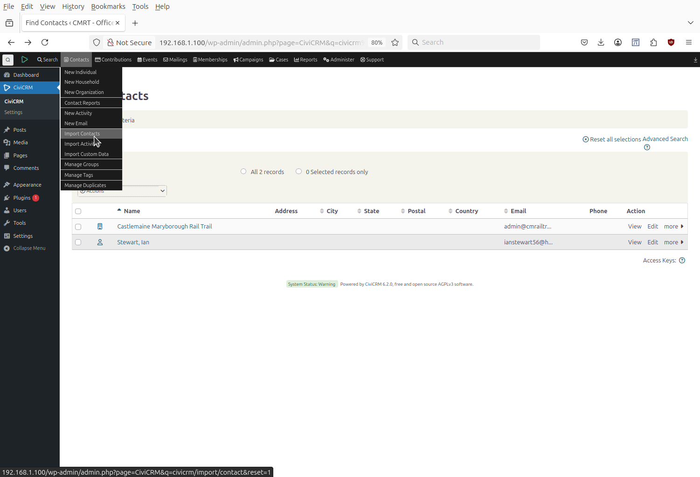
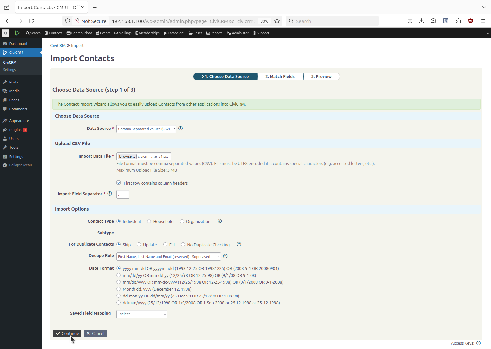
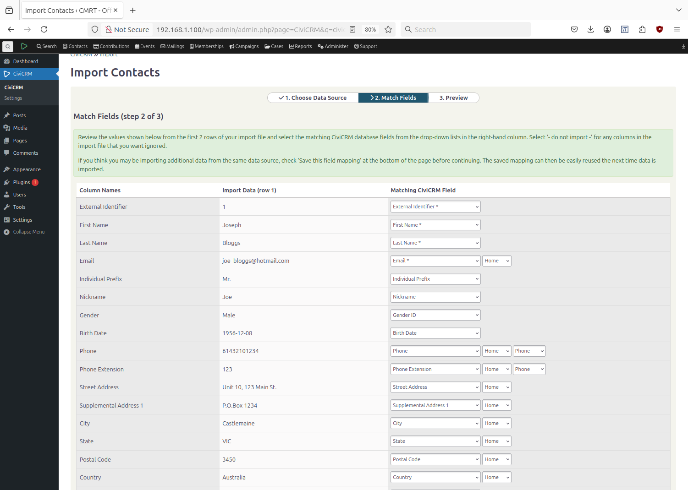
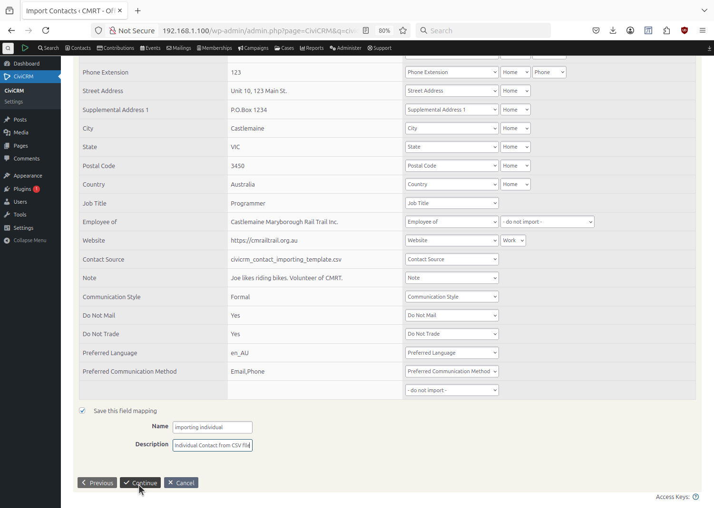
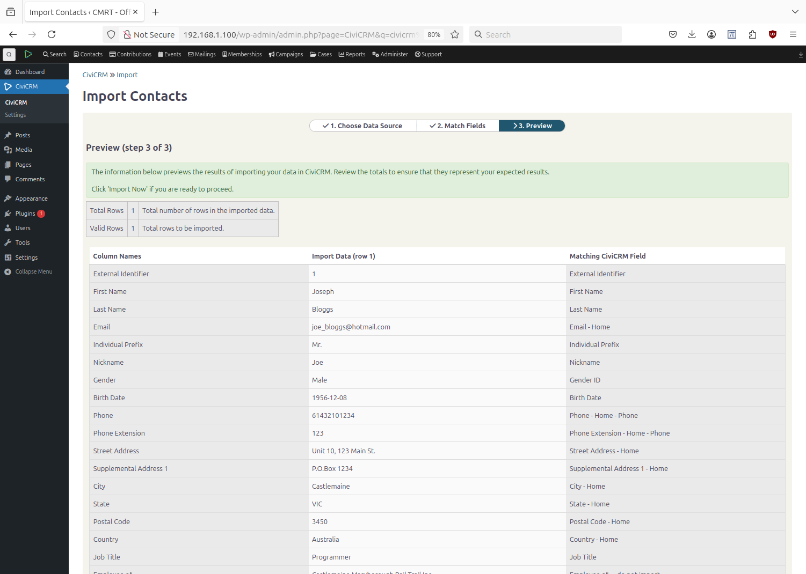
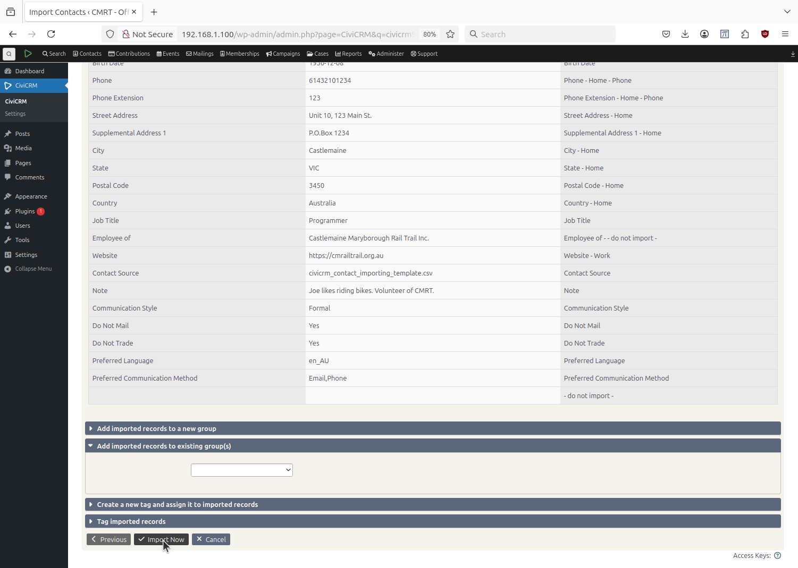
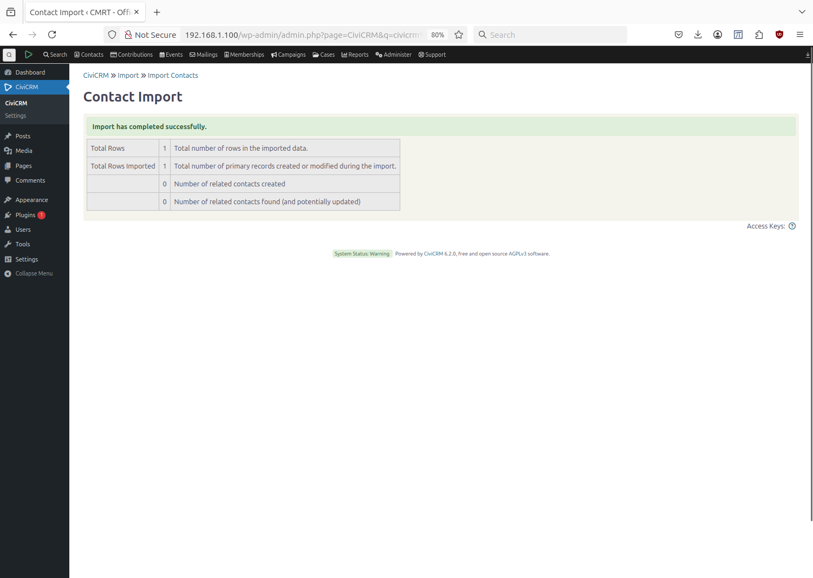
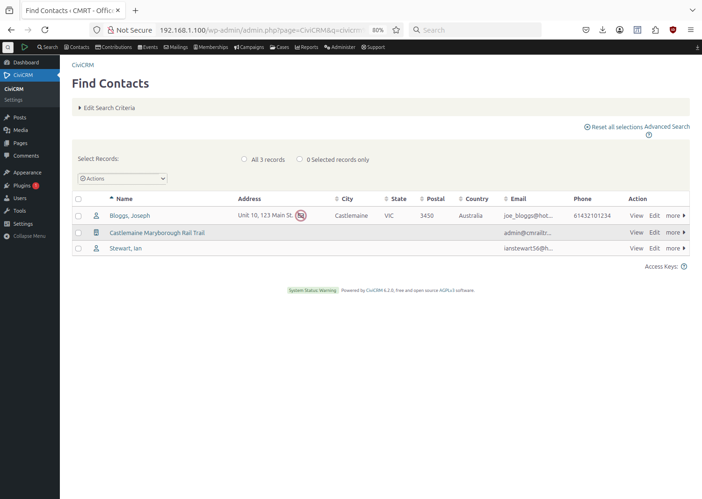
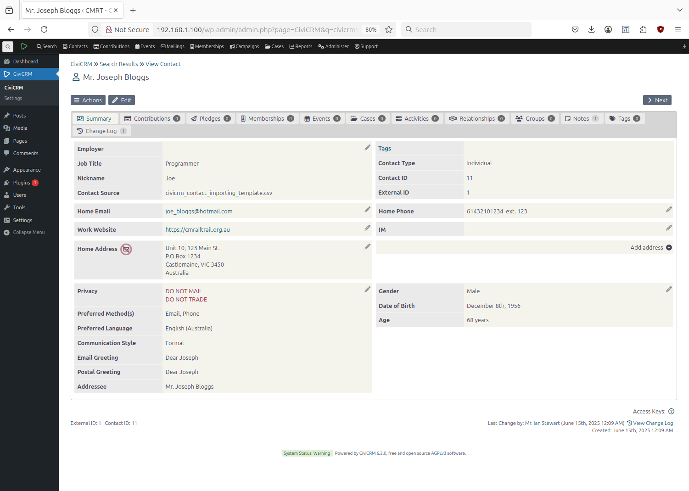

# Importing Individual Contacts.

## Introduction

The Importing of Contacts, either Individuals or Organisations, is perfomed by CiviCRM reading a Comma Separated Values (CSV) file. The data in the CSV file is mapped to CiviCRM Fields.
In CiviCRM V6.2.0 the number of separate fields that CSV data can be imported to is about 80. The way CiviCRM is setup for CMRT, many of these fields are not used. 

Some fields are automatically generated by CiviCRM and don't need to be in the CSV file. For example, if the fields *Individual Prefix* = *Mr.*, *First Name* = *Joseph*, and *Last Name* = *Bloggs* then CiviCRM will automatically make the *Addressee* field to be *Mr. Joseph Bloggs*.

## Manually Massaging data in the CSV file.

* Change the CSV fields to match CiviCRM field. For example if a column header in the CSV file is *Surname*, then rename this to *Last Name* which is the name of the CiviCRM field. This allows CiviCRM to automatically match columns of CSV data to fields that CiviCRM already recognises.
* Fix the spelling and case of the CSV data. For many fields, *Title Case* is preferred. For example, if the CSV data for the *City* field is *KASTLEMAINE*, then change it to *Castlemaine*.
* Add the Nickname column to the CSV file. If someone has put their *First Name* as *William (Bob)*, then keep the *First Name* as *William* and add *Bob* to the *Nickname* column.

## Rules of Thumb
* Settings before actually doing the importing E.g Sub-contact.
* If a fields data contains a comma, then quote the whole field. E.g. If *Street Address* = *Unit 10, 123 Main St.* then  make it *Street Address* =  *"Unit 10, 123 Main St."*
* Load Organisation data before Individual data. This way Individual data can have the field *Employee of* and the name of the already registered organisation can be the data for this field.
  
## Proposed CMRT - Contact Individual Import Fields

2025-07-17

* When importing Individual contacts from a CSV file import the following columns in the order given below.
* Those marked with * are mandatory.
* The External Identifier needs to be a unique number
* These field map exactly by name with the internal CiviCRM default fields.
* The *Info* field is a Custom field defined as a *Note* type with max of 100 chars x 10 rows.
```
External Identifier*
Email Address*
Organization Name <-- Where applicable used for "Employee of" or "Volunteer for"
Job Title
First Name*
Last Name*
Phone
Street Address
Supplemental Address 1
City
Postal Code
State
Country
Website
Preferred Communication Method
Preferred Language
Communication Style
Contact Source
Info
```


### Mandatory Fields: - (Used to check entry is unique)
```
*First Name:            Joseph
*Last Name:             Bloggs
*Email:                 joe.bloggs@homail.com
*External Identifier:   <-- ID running number from csv file. From "Counter" column

*Contact ID:            <--- Automatically supplied by CiviCRM - running number. 
```
### Desired Fields:
```
Individual Prefix:      Dont apply Mr. Mrs. Add more prefixs as required. <-- Choices: Mrs. Ms. Mr. Dr.
Nickname:               Joe  <-- for Joseph


Phone:                  61432101234  <-- Prefix with country code no spaces - Mobiles in AU 9 numbers, plus 61 prefix
Phone Extension:        123 <-- Rare to need extension? - but keep it.

Street Address:         Unit 10, 123 Main St. <--- Quoted as it could contain comma's 
Supplemental Address 1: P.O. Box 123 <-- Field not normally used except if PO Box also supplied with Address.
City:                   Castlemaine 
Postal Code:            3540
State:                  VIC
Country:                Australia

Job Title:              Programmer
Employee of:            Castlemaine Maryborough Rail Trail <--- Should be one of the already registered organizations.
Website:                cmrailtrail.org.au - Because Joe is an employee of CMRT
Contact Source:         civicrm_contact_importing_template.csv  <-- Test .csv file

```
### Set or use the default values for the following:
```
Communication Style:    Formal (or Familiar)
Do Not Email:           <--- Default is OK
Do Not Mail:            Yes <--- no Postal Mail
Do Not Phone:           <--- Default is OK
Do Not Sms:             <--- Default is OK
Do Not Trade:           Yes <--- no Trade
Preferred Language:     English (Australian)
Preferred Communication Method: Email (tick) Phone(tick) Others: Postal Mail, SMS, Fax. Data = ,"Email,Phone",

Is Opt Out:             Default is unchecked: i.e. Want "Bulk emails - User Opt Out?" = Has not.
```
### Automatically assigned - sometimes uses data from above:
```
Addressee:              - Joseph Bloggs (From Forma First Name, Last Name). Possibly Dr. or Other can be added.
Contact Type:           Individual / Organization. Determined when loading csv file.
Email Greeting:         - Dear Joseph (Formal AU, First Name)
Postal Greeting:        - Dear Joseph
```
### Manually add later if supplied:
```
Image URL:              - If photo is provided - Upload in Contact form?
```
### For Organization rather than Individuals:
```
Legal Identifier:       Castlemaine Maryborough Rail Trail Inc.
SIC Code:               ABN: 24 239 558 815 <--Use field for Australian Business Number (ABN)??? No Only supports 8 chars  
                        <-- See: https://siccode.com/ for SIC codes. What is: OR A0110387F ???
```
### Not normally used. CSV file does not normally have a these columns to upload:
```
Birth Date:             12/08/1956  - Format:mm/dd/yyyy  <-- Can format be changed E.g. 1956-12-08 (sortable)
Contact Subtype:        - Currently No Subtype for Individual Contact. Set on CiviCRM on screen before Importing data.
County:                 - N/A in Aussie.
Deceased Date:          -
Formal Title:           - Your Excellency? President? Prime Minister?
Gender:                 Male <-- Guess based on first name - Choices: Female, Male, Other - Can add more.
Household Member of:    - n/a
IM Screen Name:         - Instant Messenger - not used? 
Individual Suffix:      - III The Third
Latitude:
Longitude:
Master Address Belongs To:
Middle Name:            - N/A unless two people with same first/last name?
OpenID
Supplemental Address 2:
Supplemental Address 3:
Signature HTML:
Signature Text:
Unique ID (OpenID):
```
### Fields not used. Fields Not Exported, but may Import
```
Addressee Custom
Benefits Specialist
Benefits Specialist is
Case Coordinator
Case Coordinator is
Child of
Email Greeting Custom
Head of Household for
Health Services Coordinator
Health Services Coordinator is
Homeless Services Coordinator
Homeless Services Coordinator is
Marital Status :: Constituent Information
Marriage Date :: Constituent Information
Most Important Issue :: Constituent Information
Parent of
Partner of
Postal Greeting Custom
Senior Services Coordinator
Senior Services Coordinator is
Sibling of
Spouse of
Supervised by
Supervisor
Volunteer for
```
### Example CSV file for Individual Contact

Column Header / Fields Line:
```
External Identifier,First Name,Last Name,Email,Individual Prefix,Nickname,Phone,Phone Extension,Street Address,Supplemental Address 1,City,State,Postal Code,Country,Job Title,Employee of,Website,Contact Source,Note,Communication Style,Do Not Mail,Do Not Trade,Preferred Language,Preferred Communication Method,
```
Data for one contact:
```
1,Joseph,Bloggs,joe_bloggs@hotmail.com,,Joe,61432101234,123,"Unit 10, 123 Main St.","P.O.Box 1234",Castlemaine,VIC,3450,Australia,Programmer,Castlemaine Maryborough Rail Trail Inc.,https://cmrailtrail.org.au,civicrm_contact_importing_template.csv,"Joe likes riding bikes. Volunteer of CMRT.",Formal,Yes,Yes,en_AU,"Email,Phone",
```
## Screen Shots of Importing Individual

Selecting Import Individual Contact



Import Contacts Step 1


Import Contacts Step 2 - Top


Import Contacts Step 2 - Bottom

*Save this field mapping* is checked and given a Name: *importing individual*, and Description: *Individual Contact from CSV file* for future re-use. However when the column headers in the CSV file have been set to match known CiviCRM fields, then mapping will be done automatically by CiviCRM and its not necessary to use the saved field mapping.


Import Contacts Step 3 - Top


Import Contacts Step 3 - Bottom


Import Contacts - Completed Successfully


View the Contacts - Joseph Bloggs has been added.


View Mr. Joseph Bloggs - Summary



Note:
Note:                   Text. - Has Subject? and Body fields? <-- Test. Merge Tags with Notes? Organisation: ABN: 24 239 558 815
Created Info field as Note daatatype. 100 chars x 10 lines.


