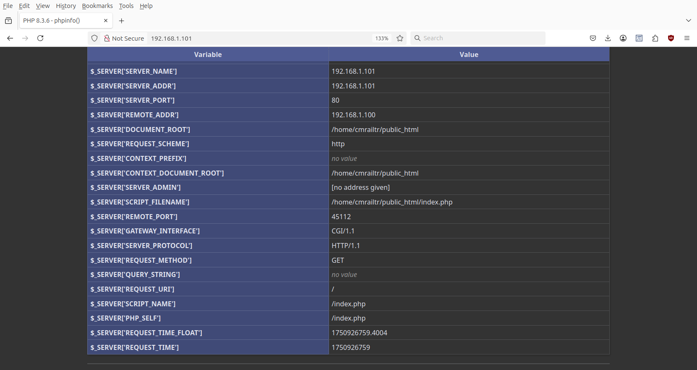

# phpinfo()

A web-browser communicating with a web-server may result in the web-server executing PHP code. This may be performed to check which PHP modules have been installed on the simulation computer.

When a browser connects to a web-address then the first activity is normally to read the file `index`. If a php command is placed into a file named `index.php`, then upon connecting to the web-site, this php command will be executed.

One such php comand is `phpinfo()` which will result in the browser displaying information similar to what is acquired with the bash command `$ php -i`.

If you already have a local web-server running then its `index` file can be temporarially replace with an `index.php` file that has the command phpinfo().

### Installing the phpinfo() index.php file.

These are the steps to replace the `index` file:

In `cmrailtr` `home` directory, use nano editor and enter `<?php phpinfo(); ?>` in the file `index.php`.
```
cmrailtr@CMRT-Demo:~$ nano index.php

cmrailtr@CMRT-Demo:~$ cat index.php
<?php phpinfo(); ?>
```
Rename the `index file` to keep a backup of it in the `public_html` directory:
```
cmrailtr@CMRT-Demo:~$ ls -l public_html/index.php
-rw-r--r-- 1 cmrailtr cmrailtr 405 Feb  6  2020 public_html/index.php

cmrailtr@CMRT-Demo:~$ mv public_html/index.php public_html/original_index.php
```
Copy the `index.php` file from your `home` directory to the `public_html` directory:
```
cmrailtr@CMRT-Demo:~$ cp index.php public_html/index.php

cmrailtr@CMRT-Demo:~$ ls -l public_html/index.php
-rw-rw-r-- 1 cmrailtr cmrailtr 20 Jun 26 20:22 public_html/index.php
```
Using a web-browser enter the web-address of the local network simulation computer: `192.168.1.101`

The replacement `index.php` file will be located and the *PHP Information* web-page will be displayed. See screeshots below.

### Restoring the original index.php file.

The `mv` command is used to restore the original `index.php` file of the web-site and remove the `phpinfo()` `index.php` file:
```
cmrailtr@CMRT-Demo:~$ mv public_html/original_index.php public_html/index.php
```
By refreshing the web-browser it will be observed that the web-site is back to normal.

### Screenshots of information displayed by phpinfo()
Top of PHP information


Configuration


Apache2


Headers Information and the first module `apcu`


Additional modules: `bcmath`, `calendar`, and `Core`:


The end of the listed modules: `zip` and `zlib`:


The environment:


PHP variables - top:


PHP variables - bottom:



 
